# PineBox Architecture Snapshot

Snapshot date: 2026-09-26 (America/Chicago)  
Repository revision: `54cfa6c18767ec9711554d9910f83f3527471e4e` (`master`)  
Evidence labels: **OBSERVED** means source or live runtime evidence; **INFERRED** means a conclusion from multiple observations; **UNKNOWN** means the available evidence is insufficient.

## What PineBox Is Today

**OBSERVED:** PineBox is a continuously running, AI-authored radio station. One large FastAPI process in `app.py` owns the show loop, scheduler adapters, generation calls, stock keepers, TTS dispatch, playout state, HTTP APIs, and most browser UI. Planning and evidence-heavy subsystems are split into modules, but they are installed into and call back through that same process (`app.py`; `system2_runtime.install`; `line_review_runtime.install`; `rejection_lab_runtime.install`).

**OBSERVED:** The live station at `10.89.1.246:8096` was healthy during collection. `/api/broadcast/health` reported three listeners and a sub-second listener acknowledgement. `/api/radio` reported playing and unpaused. `/api/playout?lean=true` reported `linear`; `/api/script/production` reported `on`; System 2 reported enabled. Broadcast admission reported `off`, so its controller was not enforcing at observation time. See `artifacts/RUNTIME_OBSERVATION.md`.

**OBSERVED:** Programming is represented twice:

- The schedule and prompt book define hour/day slots and their instructions (`app.py:SCHEDULE_KINDS`, `schedule_read`, `schedule_take`, `schedule_prompt_for`; `segment_prompts.py`).
- System 2 turns future hours into slots, preparation jobs, candidate reservations, and audible receipts (`system2.py:System2Store`; `system2_runtime.py:System2Runtime.refresh`, `prepare`, `dispatch`). Legacy shelves/keepers remain enabled as a fallback.

**OBSERVED:** A segment is instantiated by selecting a due schedule occurrence, attaching its kind-specific brief, then either reserving prepared stock or invoking that road's writer. Roads include banter, caller, news, adverts, manager messages, gallery, track talk, recap, station IDs, records, and short interjections (`app.py:SCHEDULE_KINDS`, `SEGMENT_BRIEF`, `SCHED_PREP_KIND`; `docs/extending.md`).

**OBSERVED:** Conversations are usually generated as multi-turn scripts, not token-streamed directly to air. `dj_banter` chooses a format/approach and turn count, assembles context, calls the model, validates/reworks output, then `_banter_air` or `speak_turns` renders and delivers it. Calls follow a parallel path through `dj_call_generated`, caller/topic/persona selection, `call_entry_contract`, and `speak_turns` (`app.py:dj_banter`, `_banter_air`, `dj_call_generated`, `call_entry_contract`, `speak_turns`).

**OBSERVED:** Speaker order is largely written by the LLM inside a required dialogue format, then parsed and checked by deterministic code. Topic, caller identity, source swath, approach, turn budget, emotional weather, and insertions contain RNG. Operators, schedule prompts, stock availability, and current record bindings constrain those choices. There is no single conversation-state machine with one authoritative `next_speaker` field.

**OBSERVED:** Prompt assembly layers the active station persona, road/segment brief, director notes, schedule instruction, retrieved Speakbox material, caller/record/news facts, recent/repetition constraints, and optional crystal/tint instructions. All Ollama chat traffic converges on `call_ollama`; ordinary station writing enters through `ask_model` (`app.py:active_prompt_text`, `dj_line`, `dj_banter`, `ask_model`, `call_ollama`; `crystal_prompts.py`; `segment_prompts.py`).

**OBSERVED:** The principal local model endpoint is Ollama (`OLLAMA_URL`, default port 11434). The observed writing model was `gemma4:e2b`; embeddings use `nomic-embed-text`. Deep tint can use another configured model. Image generation is delegated to ComfyUI; search/news research to SearXNG (`app.py:OLLAMA_URL`, `EMBED_MODEL`, `COMFYUI_URL`, `SEARXNG_URL`).

**OBSERVED:** Text becomes audio through a role-to-voice/engine mapping and `voice_render_any`. The render ladder tries the assigned engine, alternate clone engine where valid, then Piper for ordinary lines; cast-locked booth work can be held rather than silently changing identity. Long text is sentence/size chunked and recombined. Prepared audio is cached in the pantry, optionally assembled with SFX, admitted/sequenced, published to browser listeners, and optionally sent to the box (`app.py:voice_render_any`, `prep_render_line`, `dj_speak`; `speaker_session.py`; `conversation_assembly.py`; `broadcast_admission.py`; `playout_sequencer.py`; `station_stream.py`).

**OBSERVED:** Music comes from a local indexed library and is selected by queue/request/rotation logic (`app.py:radio_fill`, `radio_next_track`, `dj_next_track`, `_dj_loop`). SFX are indexed in `sfx_clips.db`, filtered/scored by keyword and metadata, rotated through a durable shuffled deck, and may be mixed into spoken rounds (`sfx_match.py:ClipIndex`, `choose`; `app.py:sfx_db_pick_rotation_*`; `conversation_assembly.py`).

**OBSERVED:** The operator uses the embedded browser panel, an Electron shell, or the Android kiosk. These surfaces poll REST APIs; the inbox also has SSE. Listener playback sends received/canplay/playing/ended acknowledgements into the flow journal. The Electron webview boundary is bridged by preload code (`app.py:CONTROL_PANEL_HTML`, `RADIO_PAGE_HTML`; `frontend/`; `desktop/main.js`; `desktop/renderer/webview-preload.js`; `app/src/main/assets/pine-views/`).

**OBSERVED:** State survives at several levels: task-local context variables for one model call/sitting; in-memory `_RADIO`, floor locks and current round state for the process; JSON/JSONL shelves and ledgers for restart continuity; and SQLite stores for System 2, flow, prompt history/learning, review, rejection, rhyme, and SFX. The script ledger and audible receipts distinguish intended order from heard output.

**OBSERVED:** Conversation termination is mixed. The requested line range and segment time budget bound generation; parsers require complete turns; call contracts and hangup/story rules can end calls; schedule deadlines and record boundaries constrain delivery. The LLM supplies the content of the closing turn, but code decides whether the generated script is complete, admissible, still bound, and able to fit (`system2_writing.py:turn_instruction`, `scene_complete`; `app.py:dj_banter`, `speak_turns`, `call_entry_contract`; `system2_runtime.py:dispatch`).

**OBSERVED:** What happens next is owned primarily by `_dj_loop`/the torrent show path, System 2 `dispatch`, schedule position, playout sequence, and fallback/continuity logic. It is not delegated to one model response.

## Actual Current Architecture

```mermaid
flowchart LR
    OP[Operator] -->|REST + polling| PANEL[FastAPI panel / radio pages]
    DESK[Electron desktop] -->|webview + REST| PANEL
    TAB[Android kiosk] -->|REST + audio ACKs| PANEL
    PUBLIC[Public listeners :8097] --> STREAM[StationStream]
    PANEL --> APP[app.py FastAPI process :8096]
    APP --> SCHED[Schedule + prompt book]
    APP --> S2[System2 runtime + SQLite]
    SCHED --> S2
    S2 --> ROADS[Road writers / stock keepers]
    ROADS --> OLLAMA[Ollama :11434]
    ROADS --> RETR[Speakbox/library/news]
    RETR --> OLLAMA
    ROADS --> REVIEW[Crystal, contracts, review]
    REVIEW --> TTS[TTS engines]
    TTS --> PANTRY[Prepared audio pantry]
    PANTRY --> ASSEMBLY[Conversation assembly + SFX]
    MUSIC[Music index / rotation] --> PLAYOUT[Linear sequencer / publish]
    ASSEMBLY --> PLAYOUT
    PLAYOUT --> STREAM
    PLAYOUT --> BOX[Box / Home Assistant route]
    STREAM -->|received/playing/ended| FLOW[Flow journal + air/script ledgers]
    FLOW --> PANEL
    APP --> DATA[(JSON/JSONL + SQLite + media)]
```

## What Another Engineer Must Understand Before Integrating System 3

1. **OBSERVED:** PineBox is a live single-process orchestration system. Blocking the main asyncio loop is an on-air fault.
2. **OBSERVED:** The schedule, System 2 plan, prepared-stock shelves, script ledger, playout sequencer, and listener receipts are different truths. "Generated", "ready", "committed", "published", and "heard" are not interchangeable.
3. **OBSERVED:** There are two active production paths: planned System 2 and legacy keepers/fallback. A new decision source can conflict with either or both.
4. **OBSERVED:** Dialogue is normally generated in batches, validated, rendered ahead, then aired. Fine-grained turn control is not currently a first-class durable state machine.
5. **OBSERVED:** Audio identity and order have hard contracts: role/voice binding, occurrence IDs, content/audio digests, floor ownership, record binding, admission, and listener acknowledgement.
6. **OBSERVED:** Random choices are distributed across road writers and helpers. Most are neither centrally seeded nor completely logged.
7. **OBSERVED:** Existing observability is rich but distributed across flow, script, air, model, review, and production ledgers. No single ledger currently captures every decision input and RNG draw.

## Existing Capabilities Potentially Reusable by System 3

- Schedule/hour-slot representation and System 2 jobs, leases, reservations, deadlines, and receipts.
- Speakbox/library ingestion, chunking, embeddings, source cooldowns, and prompt injection.
- Character/voice assignment, performance vectors, TTS engine registry, render caching, manifests, and session resumption.
- Conversation script parsing, contracts, repetition gates, tint/review evidence, and screenplay provenance.
- SFX indexing/scoring/rotation and conversation assembly.
- Linear playout, floor lock, broadcast admission, listener acknowledgement, stream encoding, and dead-air reserves.
- Operator surfaces for schedule, script, flow, orchestration, review, audio, and health.

## Architectural Constraints System 3 Must Respect

- Keep slow file, database, network, and CPU work off the event loop.
- Preserve schedule occurrence IDs, System 2 bindings, script `(block, ord)` order, and playout occurrence/delivery IDs.
- Never treat model output as aired without an audible receipt.
- Preserve no-dead-air behavior: failures return fallback/empty results and release leases/floor ownership.
- Do not bypass line/round contracts, record binding, repetition checks, voice identity rules, or admission/sequencing.
- Keep secret-bearing settings out of logs and UI payloads.
- Account for browser, Electron webview, Android kiosk, public stream, and box routes as separate playback actors.

## Unknowns That Must Be Resolved Before Implementation

- **UNKNOWN:** Which exact System 3 design and event schema will be proposed.
- **UNKNOWN:** Whether System 3 expects per-turn generation, whole-scene generation, or both.
- **UNKNOWN:** Which live deployment definitions are authoritative; Compose/systemd files are outside this repository and were described by existing operational docs, not directly inspected here.
- **UNKNOWN:** Whether all configured TTS engines accept structured emotion controls consistently; current engine adapters differ.
- **UNKNOWN:** Whether deterministic replay must reproduce text only, audio only, or the entire listener-observed timeline.
- **UNKNOWN:** Which legacy keepers are intended to remain enabled after assimilation.

