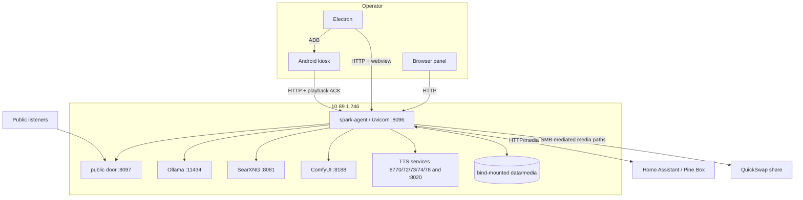

# Runtime Topology

## Observed Components

| Component | Process/service | Host | Port | Protocol | Dependencies | Started by | Persistent? | Purpose |
|---|---|---:|---:|---|---|---|---|---|
| Station API/UI | Python/Uvicorn `app:app` | `10.89.1.246` | 8096 | HTTP | data mounts, Ollama, media services | **INFERRED:** Docker Compose | Process + durable data | Orchestration, APIs, panel, listener page |
| Public door | in-process listener server | same | 8097 | HTTP/MP3-HLS | `StationStream` | station startup | No process state; media cache persists | Public stream without panel credentials |
| Ollama | local model server | same | 11434 | HTTP | model files/GPU | **INFERRED:** systemd | Model cache | writing, tint, embedding |
| SearXNG | search service | same | 8081 | HTTP | network | **INFERRED:** container | service-dependent | news/research |
| ComfyUI | image generation | same | 8188 | HTTP | GPU/models | **INFERRED:** systemd | output files | gallery/image generation |
| XTTS v2 | clone TTS | localhost from station | 8770 default | HTTP | GPU/voice refs | external host service | voice assets | primary clone speech |
| F5 TTS | alternate clone TTS | localhost | 8772 documented | HTTP | GPU/voice refs | external | voice assets | clone fallback/bench |
| CosyVoice | optional TTS | localhost | 8773 default | HTTP | model | external | unknown | optional clone speech |
| IndexTTS | optional TTS | localhost | 8774 default | HTTP | model | external | unknown | optional clone speech |
| Qwen TTS | optional TTS | localhost | 8020 default | HTTP | model | external | unknown | optional OpenAI-style speech |
| VibeVoice | optional TTS | localhost | 8778 default | HTTP | model | external | unknown | optional clone speech |
| Home Assistant/Piper | external automation/TTS | configured | 8123 documented | HTTP | token, media player | external | HA state | box route and emergency TTS |
| Electron desktop | Electron/Node | operator Windows PC | n/a | HTTP + IPC + ADB | station API, Chromium | user/app launcher | local config/cache | operator shell and kiosk bridge |
| Android kiosk | Android app/WebView/audio services | tablet (`10.89.1.154` ADB observed) | 5555 ADB | HTTP + ADB | station, desktop bridge | Android/desktop | app prefs | listener/playback/camera/mic UI |
| QuickSwap/media share | SMB | `10.89.1.125` | 445 | SMB | LAN | external | yes | media exchange |

Source anchors: `app.py:OLLAMA_URL`, `SEARXNG_URL`, `STATION_PORT`, `VOICE_ENGINES`, `XTTS_URL`, `COSYVOICE_URL`, `INDEXTTS_URL`, `QWEN_TTS_URL`, `VIBEVOICE_URL`; `station_stream.py:StationStream`; `desktop/main.js`; `docs/recreation/01-services-and-topology.md`.

## Service Findings

- **OBSERVED:** TCP probes succeeded for 8096, 8097, 11434, 8081, 8188, SMB 445, and tablet ADB 5555 during collection.
- **OBSERVED:** Port 7860 did not answer; no required current component was identified there.
- **OBSERVED:** Redis is **NOT PRESENT IN CURRENT IMPLEMENTATION**.
- **OBSERVED:** Kafka/Redpanda is **NOT PRESENT IN CURRENT IMPLEMENTATION**.
- **OBSERVED:** Postgres is **NOT PRESENT IN CURRENT IMPLEMENTATION**.
- **OBSERVED:** A dedicated vector database is **NOT PRESENT IN CURRENT IMPLEMENTATION**; vectors live in JSON/NumPy-style shards and SQLite blobs depending on subsystem.
- **OBSERVED:** General station WebSockets are **NOT PRESENT IN CURRENT IMPLEMENTATION**. Most UI telemetry is REST polling; inbox updates have SSE (`app.py:inbox_events`, `StreamingResponse(... text/event-stream)`).
- **UNKNOWN:** Host process command lines, Compose health policies, and all authoritative systemd units. The live host definitions were not in this repository.

## Communication Diagram

