# Broadcast Pipeline

## Stage Trace

| Stage | Owner | Input -> output | State read/written | Execution and failure | Next trigger |
|---|---|---|---|---|---|
| Schedule definition | `app.py:schedule_read`, `schedule_write`; `segment_prompts.py` | JSON hour/day/prompt book -> normalized slots | `schedule.json`, settings, prompt book | Sync file work, generally guarded/defaulted | clock/hour planning |
| Hour planning | `system2_runtime.py:System2Runtime.refresh`; `system2.py` | templates + candidate inventory -> hour/slot/job records | shelves, `system2.sqlite3` | Async wrapper with DB/file work moved off loop in hot paths; errors retained | prepare loop / due slot |
| Segment claim | `System2Runtime.prepare` or legacy keepers | unfilled slot/road -> leased work | jobs, task-local work context | Lease/retry; startup reclaim | road writer |
| Brief/prompt | `schedule_prompt_for`, `segment_prompts.govern`, `director_clause` | slot kind + operator/director/source context -> prompt clauses | schedule, prompt book, director notes | deterministic plus RNG source draw | model request |
| Retrieval | `speakbox_search`, `speakbox_quote`, `library.search`, news/track helpers | query/road -> chunks/facts | vector shards, chunk ledger, news cache | async HTTP/threaded disk; empty result is allowed | prompt assembly |
| Generation | `ask_model` -> `call_ollama` | messages/options -> model text | writing profile, model lanes, model-call ledgers | async HTTP, per-model lane/global gate, deferral and empty fallback | parser/contracts |
| Post-processing | road parser, `crystal_tint`, repetition and line review | raw model text -> accepted script/turns | crystal/review/repeat ledgers | deterministic validation plus optional second model pass; refused lines cut/held | render preparation |
| Speaker binding | `session_voices`, `performance_vector`, `speaker_session.py` | actor/text -> voice, engine, render requests | cast, voice ledger, character state | deterministic mapping plus performance RNG | TTS |
| TTS | `voice_render_any`, `prep_render_line` | text + voice/engine/fx -> media record | engine health, pantry, render replay | async HTTP; chunk/concat; clone/Piper ladder; may hold cast line | pantry/assembly |
| Assembly | `conversation_assembly.assemble_conversation`; SFX helpers | line cuts + optional SFX -> mixed media + cue map | manifests, SFX cadence/history | blocking ffmpeg is isolated; digest/cue verification can refuse | admission |
| Commit/admission | `script_ledger_commit`; `broadcast_admission.PlayoutController` | candidate/assembly -> occurrence | script ledger, admission ledger/checkpoint | validate identities/order; observed mode may not enforce | sequencer |
| Sequence | `playout_sequencer.LinearSequencer` | occurrence -> delivery and start time | playout snapshot/events, floor state | mode `linear` enforces order; stale entries evicted/reconciled | publish |
| Publish/play | `_dj_speak_floorless`, page handoff, `StationStream` | media path -> browser/box/stream | `_RADIO`, listener sinks, hold shelf | browser delivery and box route can differ; no-air paths return empty | listener ACK/end |
| Receipt/evidence | `page_playback_ack`, airlog/screenplay keepers, System 2 acknowledge | received/canplay/playing/ended -> heard/receipt rows | flow SQLite, air/script/model logs, System 2 receipts | append/async background writes; failures do not stop air | debt update, next slot |

## Broadcast Data Flow

```mermaid
flowchart LR
    SCH[Schedule slot] --> PLAN[System2 slot/job]
    PLAN --> INV{Ready allocation?}
    INV -->|yes| SCRIPT[Prepared script]
    INV -->|no| WRITE[Road writer]
    WRITE --> RETR[Retrieved material]
    RETR --> PROMPT[Assembled prompt]
    PROMPT --> LLM[Ollama]
    LLM --> CHECK[Parse + contract + tint/review]
    CHECK --> SCRIPT
    SCRIPT --> VOICE[Actor/voice/performance mapping]
    VOICE --> TTS[TTS render]
    TTS --> MIX[Line cuts + SFX assembly]
    MIX --> COMMIT[Script commit/admission]
    COMMIT --> SEQ[Linear sequencer + floor]
    MUSIC[Music rotation/request] --> SEQ
    SEQ --> PUB[Page/box/stream publish]
    PUB --> ACK[Listener receipt]
    ACK --> LEDGERS[Air, flow, screenplay, System2 receipt]
    LEDGERS --> PLAN
```

## Transformations and Boundaries

- **OBSERVED:** Schedule `kind` is translated through `SCHED_PREP_KIND`, `SEGMENT_BRIEF`, and road-specific functions; it is not a generic plug-in interface (`app.py:43365`, `20621`, `60913`).
- **OBSERVED:** Whole scripts may be frozen into immutable revisions and occurrence IDs (`script_manifest.frozen_script`, `occurrence_id`, `script_revision`).
- **OBSERVED:** Audio is content-addressed/digested at multiple layers (`script_manifest.content_cache_key`, `audio_digest`; `conversation_assembly.audio_hash`; pantry key functions in `app.py`).
- **OBSERVED:** Current and next audio are visible through `/api/playout`; listener acknowledgements correct estimated timing.
- **INFERRED:** The safest control interception points are before road generation, at script validation, or before playout admission. Mutating content after manifest/occurrence creation risks digest, cue, or order mismatches.

