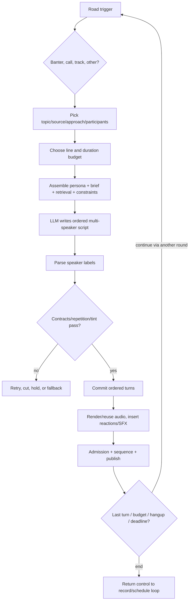

# Conversation Engine

## Lifecycle

1. **OBSERVED:** A schedule/System 2 slot, operator action, record-talk task, or continuity trigger requests a road (`_dj_loop`, `System2Runtime.dispatch`, `/api/dj/banter`, `_record_talk`).
2. **OBSERVED:** `dj_banter` or `dj_call_generated` selects a source/topic/format, binds participants, picks a line budget, and assembles instructions.
3. **OBSERVED:** `ask_model` calls Ollama for a complete text block. The expected format identifies speakers; parsing produces ordered turns.
4. **OBSERVED:** Contracts, repetition checks, optional crystal tint, and review decide which turns survive.
5. **OBSERVED:** `speak_turns` or `_banter_air` commits order, renders or reuses clips, optionally inserts SFX, assembles/publishes audio, and records evidence.

## Behavioral Ownership

| Behavior | Finding |
|---|---|
| Begin | **OBSERVED:** scheduler, System 2, show loop, operator endpoint, or continuity/watchdog code |
| Participants | **OBSERVED:** code/config selects `dj`, `cohost`, optional caller/guest; LLM receives the cast |
| Initial/next speaker | **OBSERVED:** mixed: prompt/schema and parser constrain names/order; LLM writes the actual sequence |
| Topic | **OBSERVED:** mixed RNG/config/retrieval/operator; callers use `caller_topic` and topic cooker; selected topic is passed to LLM |
| Turns generated | **OBSERVED:** generally a whole round; defaults draw 8-11 banter lines and can be overridden (`DEFAULT_DJ`, `dj_banter`) |
| Streaming | **OBSERVED:** output generation is non-streaming (`call_ollama` sends `stream: false`); completed lines/audio may be published incrementally |
| History | **OBSERVED:** `_RADIO.chat`, said/phrase/line prints, call logs, air/script/screenplay ledgers; no one canonical conversation object |
| Context window | **OBSERVED:** `ask_model` computes token/context options and limits output; source material and prompt history are bounded/truncated |
| Summaries | **OBSERVED:** recap/news/paper summaries exist; **NOT PRESENT IN CURRENT IMPLEMENTATION:** one universal rolling summary per conversation |
| Personality | **OBSERVED:** active station prompt, role names/voices, director notes, crystal world, road instructions |
| Character state | **OBSERVED:** `speaker_state`, `state_bump`, `state_decay_all`, weather/performance vectors in `app.py:31457-31986` |
| Interruptions | **OBSERVED:** floor lock serializes most speech; reply/operator lines can outrank the show; interjections have their own lane |
| Agreement/reaction | **OBSERVED:** largely LLM-authored under approach/brief; code may inject response-bank/gold/SFX reactions |
| Topic transitions | **OBSERVED:** LLM-controlled within a round, scheduler/road-controlled between rounds; approach and source can reframe |
| End | **OBSERVED:** line target, complete-scene test, call hangup rules, deadline/fit, record boundary, and model closing content are mixed |

## Randomness Inventory

| Random decision | Implementation | Outcomes/weighting | Seeded? | Logged/persistent? | Consumer |
|---|---|---|---|---|---|
| Banter length | `dj_banter`: `random.randint(min,max)` | configured inclusive range | No central seed | result visible in script, draw not explicit | prompt/parser |
| Approach/format | `approach_pick`, `unrepeated`; `segment_prompts._dial` | weighted/configured alternatives and anti-repeat | Usually no | selected approach partly in paperwork/logs | prompt |
| Topic/source | topic cooker, `speakbox_quote`, caller topic helpers | eligible topics/chunks with cooldown/filter rules | Usually no | selected source often recorded | prompt |
| Caller identity/voice | caller selection helpers around `app.py:97165-97709` | eligible names/personas/voices | No | call/caller books persist result | call writer/TTS |
| Emotional weather | `weather_roll_round`, `performance_vector` | per-seat state vector and occasional macro | local `random` or derived RNG | partial in performance metadata | text/TTS |
| Model decoding | `ask_model`, `call_ollama` | temperature/top-p jitter and fresh seed | Yes, per call when supplied | model call/options recorded in several ledgers | Ollama |
| Speakbox placement | `speakbox_rate`, prepend/append/full-swath rates | Bernoulli dials | No | chosen source/passages partly recorded | prompt/script |
| SFX choice | `sfx_match.choose`, DB deck rotation | score band, random peer/rotation | No | SFX history/deck state persists | assembly/board |
| Music choice | `radio_fill`, `dj_next_track`, queue shuffle | requests, station filter, anti-repeat, shuffle | No | queue/played ledger persists | show loop |
| TTS performance | `performance_vector`, engine payload helpers | pitch/speed/style/macros within limits | mixed | render metadata partly persisted | renderer |
| Continuity/filler | continuity helpers and reserve selection | eligible rested stock | No | aired/withdrawn evidence persists | dead-air path |

**OBSERVED:** Random calls are distributed across `app.py`, `segment_prompts.py`, `sfx_match.py`, and reaction helpers. **NOT PRESENT IN CURRENT IMPLEMENTATION:** a station-wide deterministic RNG service that records every draw and supports exact replay.

