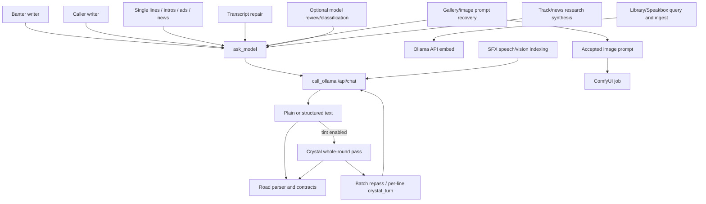

# Prompt System

## Assembly Order

**OBSERVED:** There is no single immutable prompt template. A road assembles a model request from the active persona (`active_prompt_text`), road and schedule instructions (`SEGMENT_BRIEF`, `schedule_prompt_for`, `segment_prompts.govern`), director notes/beats (`director_clause`, `director_beats_clause`), current record/caller/news facts, retrieved Speakbox/library material, repetition/quality constraints, and optional crystal/tint clauses. `ask_model` adds decode options and forwards messages to `call_ollama`.



## Significant Call Families

| Call | Called from | Model/provider | Purpose and inputs | Expected output/parser | Retry/fallback | Consumer |
|---|---|---|---|---|---|---|
| `ask_model` / `call_ollama` | all station writers | configured Ollama chat model; observed `gemma4:e2b` | generic bounded station writing; messages, temperature, top-p, seed, context | text or named result contract | lane deferral, caller fallback | road-specific parser |
| Banter writer | `dj_banter` | writing model | persona, approach, schedule brief, cast, line target, source swath, current context | labeled dialogue turns | shorter/corrective attempts, stock fallback | `_banter_air` |
| Caller writer | `dj_call_generated` | writing model | caller name/persona/voice, selected topic/story, host instructions, turn balance | labeled call transcript | contract rewrite/strike/hold | `call_entry_contract`, `speak_turns` |
| Single line | `dj_line`, radio intro/news/ad helpers | writing model | one road instruction plus facts | one spoken line/text block | deterministic fallback text/empty | `dj_speak` |
| Crystal tint | `crystal_tint`, `_crystal_round_first_pass`, `_repass`, `crystal_turn` | configured tint model, often deeper | original script, crystal world, source passages, rhyme options, faults | same speaker structure/meaning, rewritten lines | batch repass, per-line attempts, cut/hold | review/recording |
| Retrieval embedding | `library._embed` host callback, Speakbox indexing | Ollama `/api/embed`, `nomic-embed-text` | chunks/query | numeric vector | lexical retrieval/empty | hybrid search |
| SFX vision/description | clip index/vision helpers | configured vision model | clip frames/path metadata | keywords/description | retries/work lease | `sfx_clips.db` |
| Gallery/image prompt | gallery/comfy helpers | Ollama then ComfyUI | segment/source text -> image prompt | textual prompt then image job | cached/recovery prompt | gallery road |
| News/track research | news dossier, `track_notes` | SearXNG + writing model | search results/track metadata | concise factual notes | cached/empty/fallback | road prompt |
| Transcript repair | `ask_model(result_contract='transcript_repair')` | writing model | rough transcript | repaired text only | bounded/empty | ingest/content path |
| Classification/review | rejection/tint/prompt-learning paths | model where enabled plus deterministic graders | candidate, contract, fault context | structured verdict or constrained text | deterministic checks remain authoritative | review/learning |

## Representative Safe Template Shape

```text
[active station persona]
[road and schedule obligation]
[director/operator notes]
[cast and output-label contract]
[concrete topic/record/caller/news facts]
[retrieved source passages and source-use rules]
[recent/repetition/length constraints]
Write one complete scene of N turns. Return only labeled spoken turns.
```

For tint, `crystal_prompts.py` adds priority rules preserving meaning/format, the style world, source passages showing how that writer writes, rhyme/landing-word assistance, and a strict output contract.

## Storage and Observability

- **OBSERVED:** `prompt_history.sqlite3` stores compressed request/response/config bodies and previews (`prompt_history.py:PromptHistory`).
- **OBSERVED:** `model_calls.jsonl`, System 2 traces, screenplay provenance, and `/api/pipeline/detail` expose overlapping call evidence.
- **OBSERVED:** Prompt-book alternatives/modes live in `prompt_book.json` and `segment_prompts.py`.
- **OBSERVED:** Learned prompt evidence/recipes/revisions live in `prompt_learning.sqlite3` (`prompt_learning.py`).
- **UNKNOWN:** No proof was obtained that every model call has one complete, joinable prompt record. The observed screenplay provenance sometimes used a merely recent model call when an exact link was absent.
