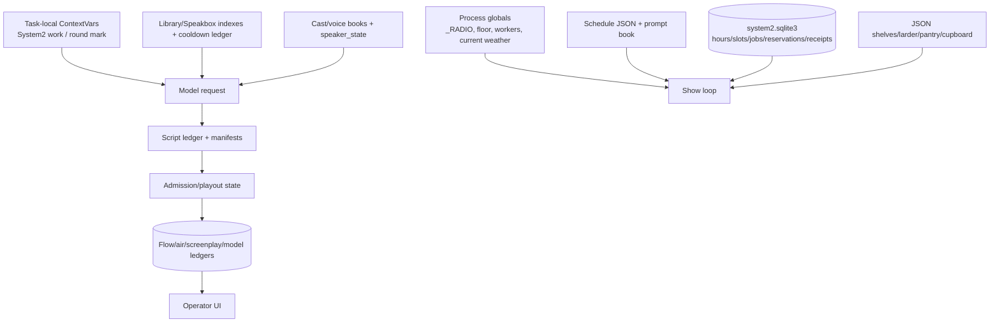

# State, Memory, and Context

## State Ownership Diagram

## Major Objects

| State | Creator/owner | Shape | Lifetime/persistence | Mutation/consumers |
|---|---|---|---|---|
| `_RADIO` | `app.py` show code | dict: on/paused/now/queue/chat/routes/workers | process; selected state mirrored to files | show loop, APIs, UI, playback |
| Floor | floor helpers in `app.py` | async lock + owner/task metadata | process/round | every speech road |
| Current round/work | round mark + System 2 ContextVars | dict with kind/model/temp/slot/job/trace | task/sitting | prompt, model capture, paperwork |
| Schedule | `schedule_read/write` | presets, active schedule, day map, ordered slots | restart-safe JSON | scheduler, panel, System 2 templates |
| System 2 | `System2Store` | hours, slots, jobs, candidates, reservations, receipts, heard, events | SQLite/restart-safe | planner/preparer/dispatcher/UI |
| Prepared stock | shelf/larder/pantry/cupboard helpers | road rows, scripts, clips, readiness, expiry, bindings | JSON/media/restart-safe | keepers, System 2 inventory, air paths |
| Conversation turns | road writer then `_RADIO.chat` | ordered `{id,who,name,kind,text,...}` | process plus JSONL/ledger copies | UI, airlog, screenplay, repeat gates |
| Speaker state | `speaker_state`, weather/performance helpers | numeric mood/energy-style fields per seat | primarily process; some voice state files | prompt and TTS payload |
| Topic/source state | topic books, document lock, chunk ledger | recent topics, selected source, cooldown/use counts | JSON/restart-safe | topic cooker, retrieval, prompts |
| Retrieval index | `library.py`, Speakbox code | document metadata, chunk rows, vectors/vocabulary | disk/rebuilt | search and prompt injection |
| Script identity | `script_manifest.py`, script ledger | revision, occurrences, `(block,ord)`, actor/text/digests | manifests/JSONL | render, admission, screenplay |
| Render sessions | `speaker_session.PerformerSession` | assignments, accepted takes, renderer config, readiness | manifest store/restart-safe where adapter persists | TTS and assembly |
| Playout | `LinearSequencer`, `PlayoutController` | occurrences, deliveries, starts/ends, ACKs, reservations | snapshots/event ledgers | publisher, listener ACKs, APIs |
| Evidence | flow/air/model/review/production stores | append-only/event rows plus checkpoints | disk/restart-safe, retention-limited | UI, recovery, learning, audit |

## Lifetime Matrix

| State class | Turn | Conversation | Segment | Multiple segments | Restart |
|---|---:|---:|---:|---:|---:|
| local text/performance vector | yes | sometimes | no | no | no |
| task-local model/System2 context | yes | yes | yes | no | no |
| in-memory round and floor owner | yes | yes | yes | no | no |
| `_RADIO.chat` and current queue | yes | yes | yes | bounded | partially |
| speaker emotional state | yes | yes | yes | process-bounded | **INFERRED:** generally no |
| schedule/prompt/director books | yes | yes | yes | yes | yes |
| topic/source/repetition ledgers | yes | yes | yes | yes | yes |
| stock and rendered media | yes | yes | yes | yes | yes |
| System 2 plans/receipts | yes | yes | yes | horizon/retention | yes |
| air/script/flow/review ledgers | yes | yes | yes | retention-limited | yes |

## Context Management

- **OBSERVED:** Recent speech is constrained through said-line/phrase/line prints and repeat checks rather than by replaying an unlimited transcript into every prompt.
- **OBSERVED:** Retrieval inputs are bounded by top-k/per-document caps, passage character limits, document locks, and cooldown ledgers (`library.search`; `speakbox_quote`; `segment_prompts.expand`).
- **OBSERVED:** `ask_model` clamps output characters, derives token budget, accepts `num_ctx`, and records decode settings.
- **OBSERVED:** The model call itself is stateless; continuity is reconstructed in each request from explicit context.
- **NOT PRESENT IN CURRENT IMPLEMENTATION:** one normalized durable schema containing conversation, turns, emotional state, decision events, and audio receipts as a single aggregate.

