# Audio and TTS Pipeline

## Audio Graph

```mermaid
flowchart LR
    TXT[Accepted spoken text] --> CAST[Role -> voice/engine]
    CAST --> PERF[Performance vector / engine payload]
    PERF --> CACHE{Pantry hit?}
    CACHE -->|yes| CUT[Verified line cut]
    CACHE -->|no| RENDER[voice_render_any]
    RENDER --> E1[Assigned engine]
    E1 -->|eligible failure| E2[Alternate clone engine]
    E2 -->|ordinary-line failure| PIPER[Piper floor]
    E1 --> MEDIA[WAV/media store]
    E2 --> MEDIA
    PIPER --> MEDIA
    MEDIA --> CUT
    CUT --> MIX[Conversation assembly / ffmpeg]
    SFX[SFX clips + cue timing] --> MIX
    MIX --> ADMIT[Manifest verification + admission]
    MUSIC[Decoded music] --> STREAM[StationStream mix/encode]
    ADMIT --> SEQ[Linear sequencer / page handoff]
    SEQ --> STREAM
    SEQ --> BOX[Box/HA route]
    STREAM --> MP3[MP3/HLS/browser sinks]
    MP3 --> ACK[listener received/playing/ended]
```

## Text to Playback

1. **OBSERVED:** Actor labels are resolved through cast/role state (`VOICE_ROLES`, `session_voices`, `voice_engine_for`).
2. **OBSERVED:** `performance_vector` combines speaker state, weather, voice, and optional macros. Engine adapters translate supported fields.
3. **OBSERVED:** Pantry lookup can reuse an exact text/voice/engine render.
4. **OBSERVED:** `voice_render_any` chunks overlong text, renders each part, joins local files, stores served media, and returns path/signature/duration/provenance.
5. **OBSERVED:** `speaker_session.PerformerSession` plans assignments under renderer capacity, accepts verified takes, persists/resumes sessions, and exposes readiness.
6. **OBSERVED:** `conversation_assembly` verifies masters/cuts, measures WAV facts, mixes turns/SFX with ffmpeg, and creates cue maps/manifests.
7. **OBSERVED:** admission and the linear sequencer assign occurrence/delivery identity and order.
8. **OBSERVED:** `StationStream` decodes/mixes PCM, feeds MP3/HLS encoders and listener sinks; browser/box routes are separately selectable.

## Engines and Endpoints

`app.py:VOICE_ENGINES` includes Home Assistant/Piper, file/browser paths, XTTS, F5, Voxtral, CosyVoice, IndexTTS, Qwen TTS, and VibeVoice adapters. Defaults include XTTS `:8770`, CosyVoice `:8773`, IndexTTS `:8774`, Qwen TTS `:8020`, and VibeVoice `:8778`. Availability is runtime/config dependent; listing an adapter does not prove its service was healthy.

## Format, Processing, and Concurrency

- **OBSERVED:** WAV is the core prepared/assembly format; media is served by path/signature. `conversation_assembly` normalizes/read-writes PCM and can use ffmpeg for mixing/measurement.
- **OBSERVED:** `StationStream` snaps rates and emits encoded MP3/HLS. Exact output sample/bit rates are configurable/runtime-specific (`station_stream.py:snap_rate`, `_Encoder`, `_HlsEncoder`).
- **OBSERVED:** Voice rendering has per-engine health, work pools/limits, and prepared-stock lookahead. The observed recording room reported a six-script pool cap.
- **OBSERVED:** Cache keys include text, voice, and engine; script/audio digests guard identity (`script_manifest.content_cache_key`, `audio_digest`).
- **OBSERVED:** Pauses and punctuation are represented by line segmentation, beats, and assembly timing. Pronunciations are part of frozen script line/session records.

## Emotion and Intonation Finding

**OBSERVED:** Structured performance metadata exists independently of spoken text: `performance_vector`, `perf_directive`, `fx` maps, `RendererConfig`, and performance digests can carry speed/pitch/style-like fields without changing text.

**OBSERVED:** Support is not uniform. Some engines consume richer payloads, others only voice/text or crude speed/pitch controls, and Piper is intentionally a plain fallback.

**INFERRED:** PineBox has a usable seam for independent emotion/intonation metadata at actor assignment/render-request time, but there is no engine-neutral schema with guaranteed equivalent semantics across every adapter.

**UNKNOWN:** Which non-XTTS optional engines are live and which exact emotion fields they currently honor.

