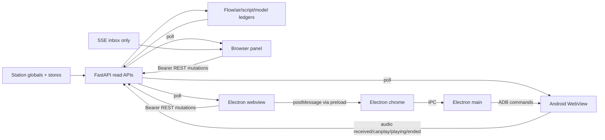

# UI and Control Surfaces

## Surfaces

| View/surface | Frontend | Backend/state | Update | Actions |
|---|---|---|---|---|
| Main station panel | embedded `CONTROL_PANEL_HTML` in `app.py` plus `frontend/` modules | broad `/api/*` | REST polling, animation frames | start/pause, schedule, prompts, roads, voices, review, health |
| Radio/listener page | `RADIO_PAGE_HTML`, mirrored listener assets | `/api/dj/state`, radio/media/playback ACK routes | 1.5-4 s polling plus audio events | play/listen, volume, listener ACKs |
| System 2 | `frontend/system2.js` | `/api/system2/status/hour/script/line` | 15 s polling | settings, inspect plans/scripts |
| Station flow | `frontend/station-flow.js` | `/api/dj/flow` | incremental REST polling | inspect topology/events |
| Script/screenplay | panel script code and Android/desktop copied view | `/api/screenplay*`, `/api/playout`, `/api/director/trace` | 2.5 s or action-driven polling | notes, replay, provenance, export |
| Orchestrator glass | `desktop/renderer/orchestrator-glass.js` and panel | `/api/orchestrator/glass`, asks/policy/logic | 2-5 s polling | answer asks, policy/judgment, recovery |
| Scheduler/segments | panel + `desktop/renderer/pine-segments.js` | `/api/schedule*`, promptbook, segment jobs | polling/job watch | edit/activate/generate/pin/prioritize |
| Review/rejection | panel + desktop review modules | `/api/orchestrator/rejections*`, line/rejection APIs | polling | approve, note, reply, replacement |
| Voice/audio | panel voice director/booth, desktop audio modules | `/api/voice*`, booth clips, service health | polling | assign/render/test/replay/levels |
| SFX/music | panel/desktop soundboard, clip doctor, radio views | `/api/sfx*`, `/api/music*`, `/api/radio*` | polling | play/ban/delete/weight/queue/skip |
| Android kiosk | Kotlin services + WebView assets | station REST/media | polling/audio callbacks | playback, mic/camera, kiosk lifecycle |
| Electron chrome | `desktop/main.js`, `renderer.js` | station REST, webview IPC, local ADB | polling + IPC | shell controls, kiosk restart, local bridges |

## UI Telemetry Flow

## Three Proposed Views: Compatibility

1. **Conversation View:** **OBSERVED compatible foundation.** `_RADIO.chat`, screenplay elements, caller/round metadata, voices, media, and provenance already exist. Missing: one authoritative conversation ID/state aggregate across all roads.
2. **Technical/RNG View:** **PARTIALLY COMPATIBLE.** Flow, model, System 2, review, and playout telemetry are rich. Missing: centrally emitted RNG draws and normalized decision events.
3. **Final Script View:** **OBSERVED compatible foundation.** Script ledger, screenplay, `(block,ord)`, clip links, cue/action elements, and playout state exist. It already distinguishes scripted versus caught-up heard lines.

**OBSERVED:** The interfaces subscribe primarily by polling, not a push stream. Any synchronization tighter than current 1.5-15 second polling needs either coordinated polling against common IDs/timestamps or a new delivery mechanism.

**OBSERVED:** Electron chrome and the station panel are separate documents. The webview preload bridge is required for shared playback/script state; direct DOM access from chrome is not valid (`desktop/renderer/webview-preload.js`; `docs/recreation/01-services-and-topology.md`).

