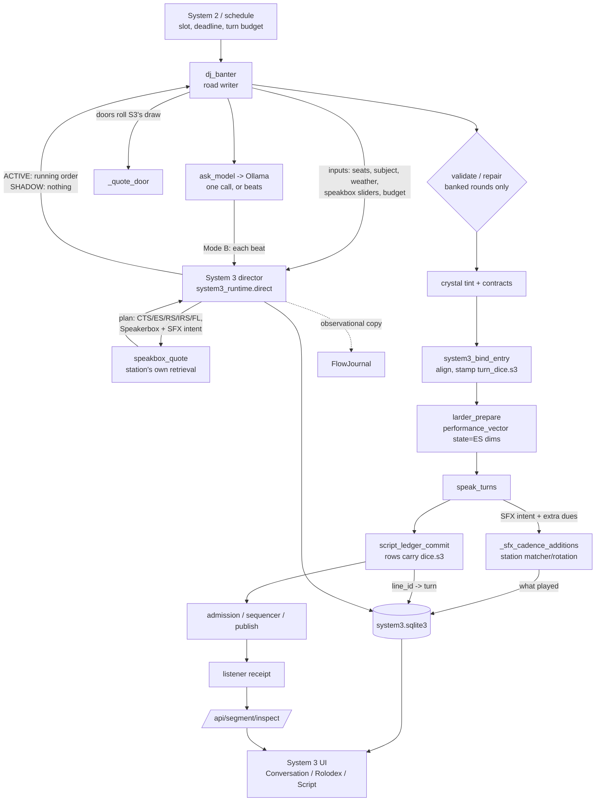

# System 3 — Architecture

System 3 is the conversation director described in `docs/System 3.pdf` and
`docs/system3_blueprint.md`. It decides what kind of conversational action
happens next. The existing writer model still writes the words.

It adds one thing the architecture snapshot found missing (`PINEBOX_ARCHITECTURE_SNAPSHOT/19_OPEN_QUESTIONS.md`,
"Explicit Absences"): an authoritative conversation aggregate with a seeded,
fully logged decision engine. Everything else it uses already existed.

## Where it sits

## Modules

| File | Responsibility | Blocking work |
|---|---|---|
| `system3_tables.py` | The versioned default tables (CTS1, ES1, RS1, RS2, IRS1, IRS2, FL1, FL2) and the banter-cycle structure. Data only. | none |
| `system3.py` | The engine: aggregate, `DrawStream` RNG, weighted draws with recorded effective weights, planner (Mode A), observe/replan (Mode B), protocol annotation for calls, Speakerbox and SFX decisions, ES→`PerformanceIntent`, the running-order renderer, deterministic validation, decision replay. | CPU only, bounded (typically 10–25 ms per round). No I/O, no clock-driven decisions. |
| `system3_store.py` | `data/system3.sqlite3`: settings, config versions, conversations, events (decisions and later observations), line links. The one authoritative System 3 record. | Called only from System 3's own single-thread executors. |
| `system3_runtime.py` | `install(app, globals())`: the station hooks, `/api/system3/*`, `/system3` page and assets, retention. | Store writes on `system3-store`, reads on `system3-read`, share I/O on `system3-io`. Never the default executor. |
| `frontend/system3.js`, `.css` | The operator instrument. | none |
| `tools/system3_patch_app.py` | The 22 anchored edits that wire the hooks into `app.py`. Idempotent (`--check` / `--apply`). | none |

## The hooks in `app.py`

Every hook is reached through `globals()[...]` after a `globals().get(...)` guard, and
each returns `None` or does nothing when System 3 is off, not yet loaded, or
failed. That state is exactly the legacy station.

| Site (function) | Hook | Effect when ACTIVE | Effect when SHADOW |
|---|---|---|---|
| module level, after `install_system2` | `install_system3` | routes, hooks, startup load | same |
| `dj_banter`, before the #1386 topic draw | `system3_direct_banter` | plans the round and resolves Speakerbox material. The legacy mid-round topic draw stands down. | plans and records only |
| `dj_banter`, call-sheet branch | `system3_direct_banter(call_sheet=)` | adds each turn's emotion and response act to the call protocol | records only |
| `dj_banter`, running-order assignment | (handle) | System 3's sheet replaces `banter_beat_sheet` | legacy sheet |
| `dj_banter._quote_door` | `system3_door_roll` | the door's roll is System 3's recorded draw; the station still applies its slider and lift | `random.random()` |
| `dj_banter`, before the rewrite gate | `system3_repair_wanted` / `_clause` | a banked round that ignored the order gets one bounded rewrite with the order attached | never |
| `_banter_beats` loop | `system3_director` | Mode B: observe written turns and re-decide the rest (only when `generation_mode=turn`) | never |
| `dj_banter`, before banking/air | `system3_bind_entry` | aligns the final (tinted) script, validates, stamps `turn_dice[i].s3` | records the shadow comparison |
| `larder_prepare` | `system3_perf_state` | the turn's ES dims become `performance_vector(state=)` | never |
| `_sfx_cadence_additions_inner` | `system3_sfx_direction` / `_observe` | intent words join the matcher's query; planned extra dues are added on top of the cadence | observes what played |
| `sfx_match_sting_pick` | (counts) | `_SFX_MATCH_LAST` gains `cands/tied/eligible` | same |
| `script_ledger_commit` | `system3_observe_ledger` | links `line_id → turn` (script freeze) | nothing to link |
| panel | `system3Open()` | opens the instrument | same |

## What System 3 does not own

The schedule, System 2, road choice, prepared-stock shelves, voice binding,
render ladder, assembly, admission, sequencing, publication and receipts
keep their current owners. System 3 decides nothing after the script
freezes. See `SYSTEM3_DECISION_OWNERSHIP.md`.

## Dialogue recovery

The operator's choices `1A 2B 3A 4A 5A 6B` define the recovery policy:
repair failed turns, rewrite, reroll instructions, then rebuild the exchange.
Two consecutive occurrences of the same rejection mark an approach stuck.
Each pass tries three distinct operations before a cooldown; the next pass
continues with fresh recorded variations until the dialogue succeeds.
Due recovery choices gain priority and alternate with other runnable work.
Model admission deferrals do not count as rejected creative attempts.

`dialogue_recovery.py` owns the persisted attempt, cooldown and scheduling
decisions. `dialogue_repair.py` prepares one isolated candidate with at most
one whole-exchange writing request per operation. System 3 records the actual
prompt permutation, seed, operation, creative policy and rebuild ancestry.
New plan revisions keep the original speakers, names, roles and voices, with
unique turn and event identities for newly planned material.

Randomness may change instruction wording/order and a free banter topic or
structure. Grounded facts, caller/news/memo premises, character, protected exact
copy and mandatory conclusions remain preserved. Rhyme, optional length targets
and decorative style loosen progressively. Every candidate still passes the
current plan's full turn-count and speaker-order checks and its ordinary review
gates; an incomplete exchange never becomes ready stock.

Recovery debt survives failed preparation and restarts. A changed approved
script invalidates old recordings before it re-enters recording and playback.
An unrecorded draft binding may reopen with ancestry recorded; committed ledger
lines and speech already in flight remain immutable. Preparing valid words is
an intermediate result: brief review and recording still determine whether
the recovered dialogue can air.
