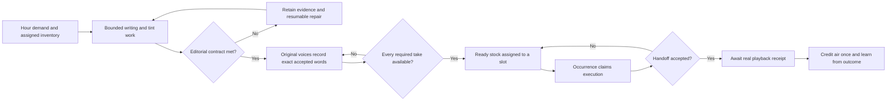

# Pine Box radio pipeline audit — 7 September 2026

This investigation followed the live station from writing demand through
editorial acceptance, recording, slot execution and acknowledged playback.
Three independent audits covered writing, recording and scheduling; the main
audit checked live evidence, integration and the operator's view.

## What the live evidence establishes

The station was on with playback **paused** throughout the initial observation.
Its six-hour preparation target had about **20.8 minutes** of genuinely ready
audio. The recording endpoint reported zero new ordinary takes since restart,
while the writing model remained busy. The tint contract required **100%**
coverage, with the selected crystal's strength at **88%**. These requirements
are operator settings, and this audit does not lower them.

The old review-room display said 95 items were waiting and 48 were ready. Those
figures came from stored `prepared` flags and mixed editorial debt with recording
debt. They could not establish that 48 items met the current contract and still
had every required audio file. The new counts use the same readiness predicates
as scheduling and include single-read ads and station IDs.

The measured capacity estimate was roughly 622 minutes of task latency for one
hour's fresh spoken content. This is **not a physical hardware benchmark**:
those latencies include queueing, failed attempts and concurrent work. The live
writer snapshot actually showed four tint jobs on the same model despite a
displayed limit of two station jobs. Tint had an unlimited exception to that
limit. Repairing that queue is necessary before treating these measurements as
useful evidence about fresh-production capacity.

The read-only initial snapshot is
[pipeline-audit-before-2026-09-07.json](pipeline-audit-before-2026-09-07.json).
It contains counts, timing and policy evidence, without credentials or complete
private scripts. No test broadcast, operator quality decision or synthetic
playback receipt was submitted to the live station.

## Reproduced defects and corrections

| Boundary | Defect | Correction and required behavior |
| --- | --- | --- |
| Schedule → execution | `schedule_take()` consumed `sched_first` during status reads. Slot zero was also mistaken for a missing index. A poll could suppress an ad's first turn or repeat the first slot's action. | An occurrence owns its pending first action. Reading does not consume it; successful execution commits it. Failed or cancelled work remains retryable, and an old completion cannot consume a new occurrence. |
| Clock health | The jam detector compared a previous occurrence's start time with the next occurrence's duration. | Read the current occurrence before measuring its age. |
| Competing programme clocks | An old physical-box timestamp could declare the air quiet even while the app had recent audible playback receipts. | Determine quiet from the actual voice route and verified audible receipts, including the configured box fallback. |
| Writing admission | Tint jobs bypassed bounded model admission; single-line jobs could also wait before appearing on the writer board. | Bound admitted tint work and expose its category, limit and deferred state. Deferral retains the original, completed candidates and remaining work; it is not an empty rewrite or an editorial rejection. |
| Work ordering | Paused and caller-floor overrides could commission another script while viable assigned work still needed completion. | Account for existing committed work before those fresh-writing overrides. |
| Tint retries | Whole-round and batched repairs were followed by a repeated outer fallback, which multiplied the retries inside the line helper. | Bound the fallback without weakening the evaluator; unresolved lines remain resumable work. |
| Single-read recording | The first rejected raw read prevented later recordable reads from being attempted; failed tint could immediately repeat. | Prefer accepted pending reads, respect retry rest, and move on after an unsuccessful attempt. |
| Parallel recording | Every engine waited on the same first script, spending its own deadline behind another engine even when another script was free. | Select free work fairly. Waiting for ownership does not consume the actor's working allowance; cancellation releases ownership and engine admission. |
| Restart recovery | Raw shelf rows retained process-local `tinting` and `preparing` flags. Persisted repair status could claim a dead worker was still repairing. | Clear stranded ownership on both raw and nested rows while retaining words, voices, successful progress, attempts and audio references. |
| Operator-approved recovery | Ordinary stocking could rewrite an exact approved single-read candidate before the review worker recorded it. | Give the dedicated review-recovery worker sole ownership until its exact regrade and recording handoff completes. |
| Produced-ad handoff | Gap filling removed stock and credited use even if there was no playable audio or accepted destination. Publication could also be mistaken for actual air. | Preserve stock until accepted handoff; credit actual air only from verified playback, once. |
| Schedule feedback | Banter used to cover a missing news, gallery or manager segment could mark that original obligation as fulfilled. | Record fallback cover separately from fulfilling the scheduled content requirement. |
| Preparation feedback | A task inherited global ready-audio gains and unrelated on-air Piper activity; admission deferral reduced its learned success rate. | Stop attributing other jobs' output to the task. Exclude declared admission deferrals from production failures and disclose unmeasured gains. Existing history is retained, not silently recalibrated. |
| Operator diagnostics | A paused station accrued a talk-gap warning and could be described as a wedged box. Old prepared flags overstated readiness. | Suspend live-gap diagnosis while paused/off and report mutually exclusive current writing, tint, recording, replacement and ready states. |
| Produced stock readiness | A stored produced-ad ID counted as complete audio even after its file disappeared. Ordinary raw recording skips produced spots, so this could also reserve impossible work. | Require the actual nonempty audio file; a missing produced take needs replacement and cannot block new assigned work as viable recording debt. |
| Complete stock → 100% talk playback | The zero-generation policy redirected ready gallery, manager and news work to banter/caller stock; when those were empty, brief continuity aired instead. The generic recorded player could also rebuild voices/chunks or generate a replacement after a cache/transport failure. | Keep an eligible scheduled road and play its exact saved takes through a strict path. Validate positions, words, voices and audio; no writing, re-recording or generated interjections may occur on that path. Missing work returns for repair rather than causing live generation. |
| Finished programme → slot duration | The first natural gallery selection used a 202-second recording in a three-minute slot, although shorter finished programmes were available. | Select complete takes that fit the remaining matching occurrence, including page reservations and assembly/transition allowance. Preserve oversized stock and recheck the occurrence and deadline before handoff. |

## What the orchestrator can now coordinate

The orchestrator already has a demand planner, inventory commitments, measured
task costs, a deadline order, bounded engine admission, resumable scripts,
per-voice takes, replay stock, delivery receipts and outcome memory. These are
the means needed to run a station. The defects were in the connections between
those means: reading consumed execution state, queued writing bypassed its
limit, engines blocked each other unnecessarily, and some failed handoffs were
credited as successes.

The corrected order is:

The orchestrator panel now shows the actual stage counts, active writers,
waiting writers and recording-engine activity beside its planning rationale.
It states which requirement is currently holding work and links directly to
Rejected lines. The review-room overview uses the same counts. An idle engine
at one snapshot is described as an observation, not proof that it has failed.

Task cost remains observed elapsed latency, including queue waits. Where an
exact task-owned completion receipt is unavailable, gain remains explicitly
unmeasured and the planner uses its existing history or seed estimate. The
audit removes false new attribution; it does not claim that the old ledger has
become a controlled service-time benchmark.

## Verification and practical limits

Regression checks use isolated data, deterministic model/render substitutes,
controlled clocks and actual production coordination functions. They test
polling races, occurrence transitions, unsuccessful handoffs, cancellation,
concurrent actors, admission saturation, durable deferral, restart recovery,
exact approved wording, real readiness predicates and paused diagnostics.

End-to-end timing still depends on having accepted scripts and completed takes
before their slots. Bounded queues cannot guarantee that a rewrite meets a
strict semantic/style contract, nor can an operator's approval create missing
audio. The station remains responsible for showing those outstanding
requirements and using its configured fallback/reuse policy when a slot lacks
ready material. No claim of a live uninterrupted broadcast can be made from a
paused observation; scheduling and receipt behavior are separately exercised
in isolated regressions.

The read-only checker is `tools/pipeline-audit-inspect.py`. It samples the live
pipeline using GET requests and can save a sanitized before/after artifact.
## Deployment observations

The first integrated deployment passed **506 Python tests** and **13 Node
tests**, plus syntax validation of both delivered page scripts. A restart
guard detected that the operator had resumed playback during the investigation
and postponed deployment while speech was active. The restart proceeded at the
next observed quiet gap and preserved the current unpaused state. The initial
empty startup snapshot was transient; the normal radio startup then restored
the retained inventory.

The live post-startup writer queue showed one active tint job and one waiting,
with additional tint requests explicitly deferred. The recording engine was
observed working. A subsequent disk check found **12 newly stored takes**,
each with a newly written audio file, totaling **154.44 seconds**. These were
ordinary station work in the original host/cohost voices: two ad takes and ten
banter takes. This establishes actual recording progress, not completion of
every unfinished programme. The observation is saved in
[pipeline-audit-progress-2026-09-07.json](pipeline-audit-progress-2026-09-07.json).

The normal listener also returned **five completed deliveries**, each with two
scheduled and two acknowledged cast lines and no unconfirmed line IDs. No
synthetic receipts were sent. Those deliveries were short continuity cover;
they did not prove that the scheduled news or gallery requirements were met.
That distinction exposed a further live selection fault: 100% talk could
choose empty banter/caller stock while seven complete gallery and four complete
manager rounds were available. The final selection correction is verified
separately below.

A read-only inspection of those eleven actual stored programmes found complete,
contiguous take positions and matching saved text/voice metadata. One gallery
had 18 take positions using 17 distinct audio keys: the repeated position is a
real line in the programme and must not be removed by key deduplication.

An independent execution of the saved-take validator then accepted all eleven:
seven gallery programmes with 78 positions and 847.54 seconds, and four manager
programmes with 24 positions and 222.27 seconds. That is **102 ordered takes and
17 minutes 49.81 seconds**. This check reads real metadata and audio files but
uses isolated process state; it does not publish anything or waive the live
profile, freshness and reuse rules. The sanitized
[compatibility result](pipeline-audit-saved-takes-2026-09-07.json) records the
individual programme counts without including their scripts.

The actual production concatenator also assembled the 18-position gallery
programme using its 17 original files. It produced a complete **175.555-second
WAV** in **2.826 seconds**, with valid 24 kHz mono 16-bit PCM and unchanged
SHA-256 hashes for all source files. The repeated position remained an ordered
input. Only a temporary output was written; no broadcast or synthesis was
triggered. The [real-file assembly result](pipeline-audit-concat-2026-09-07.json)
closes the gap left by the regression suite's controlled audio substitutes.

The read-only Radio and Control UI check passed. Both showed current pipeline
counts and rejection context. The orchestrator graph displayed its new status
panel and its inspection button opened Rejected lines. The checker sent zero
writes and played zero media. Control's automatic active-station feed attempted
13 plays; all were blocked by the checker, independently of the real listener.
The [UI result](pipeline-audit-ui-2026-09-07.json) and
[inspected screenshot](pipeline-audit-ui-2026-09-07.png) retain that evidence.

## Final playback regression checks

The completed change passed **548 Python tests** in a fresh isolated data and
bytecode directory. The only failed intermediate run exposed an existing
wall-clock-dependent test fixture at precisely 09:00: its “ten seconds ago”
receipt belonged to the previous half-hour. The fixture now uses a fixed local
time; the production half-hour boundary behavior was correct.

Strict playback regressions cover exact take order and saved voices, complete
source coverage, repeated positions, missing media, concatenation failure,
disabled destinations, pause, cancellation before and after handoff, and late
review withdrawal. A final eligibility check runs immediately before the first
publication or box send. It compares the original shelf row's current contract
and take identities with the reserved performance.

The tests also verify that gallery, news and manager retain their original
schedule requirement at 100% talk. Their independent clock calls use the same
finished-stock path by default; explicit off-air preparers continue producing
stock. If the required take is lost, fallback cover is recorded as cover and
the original requirement remains missed. Page and box receipts together credit
each line once, using its actual programme type. Source, news and manager
completion memory waits for complete acknowledged playback.

## Natural broadcast confirmation

After the strict-player deployment, the normal running order selected a stored
gallery programme. Delivery `db601205885b4f4c` completed with **10 scheduled and
10 acknowledged lines**, no unconfirmed IDs, and the original two saved voices.
Its programme type and schedule outcome were gallery, with no fallback-cover
credit. No test broadcast or synthetic receipt was used. The
[retained live result](pipeline-audit-ready-playback-2026-09-07.json) also found
**43 new stored takes and 43 new audio files, totaling 541.71 seconds**, since
the first integrated deployment.

This programme played completely but ran past its three-minute slot: its saved
take estimate was 208.49 seconds and the assembled stream lasted 202.04 seconds.
Other finished gallery choices were approximately 58, 69, 91, 96 and 137 seconds.
That evidence justified the final duration filter. The transport confirmation
establishes complete recorded playback; the duration regressions separately
verify that selection respects the remaining slot and preserves longer stock.

The final duration checks include a long first choice followed by a fitting
choice, repeated audio positions, prior page reservations, waiting for the
floor, a shortened deadline, and replacement of a slot with the same display
ID but a new occurrence. After concatenation, the final check uses measured
joined audio length without charging assembly time again. Independent clocks
defer to a different active scheduled road; off-air preparation and unscheduled
operation keep their existing behavior.

The final timing build was deployed after a verified quiet gap and restored
the current **on, unpaused** station state. The first warm snapshot showed 18
ready items, five items still needing recordings with an active XTTS render,
93 awaiting tint approval, and 45 needing replacement. The operator's editorial
policy remained enabled at revision 1 with zero allowed faults and no disabled
gates. The [deployment record](pipeline-audit-deployment-2026-09-07.json) retains
the code hash, test counts, restart guards and restored state; the
[latest pipeline snapshot](pipeline-audit-after-2026-09-07.json) records the
subsequent live state.

The later post-deployment streams were newly selected banked banter. Live logs
showed `manager → banter` and `recap → banter`; the generic coalesced player
labels these rows `call`. Completed streams had 14/14, 9/9 and 14/14 line
acknowledgments. They carried no strict `ready_round` metadata, and the observed
render-recovery queue was empty. These were fallback selections, not evidence
that gallery or manager met those later slots.

**Remaining operating limit:** the duration guarantee applies to the strict
prepared gallery/news/manager path. Existing generic fallback talk can still
occupy scheduled time when that selector cannot supply a permitted fitting
programme. The live check establishes speech continuity and the earlier exact
gallery delivery; it does not certify a full hour of on-time requirement
fulfillment. Meeting every slot also requires enough suitable accepted stock
and a fallback policy consistent with the clock. The audit preserved the
operator's continuous-talk and editorial settings.
